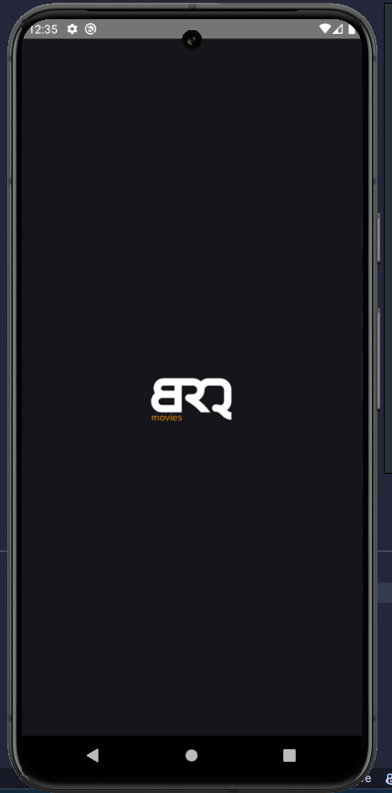
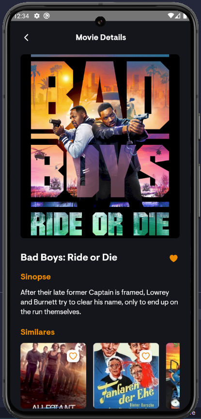
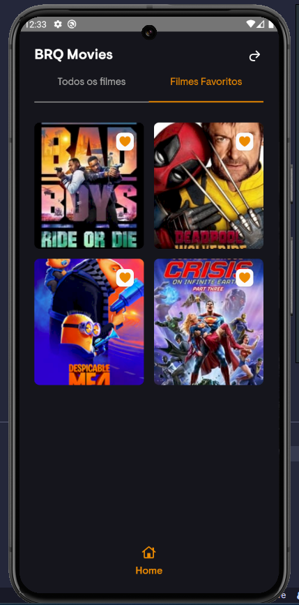
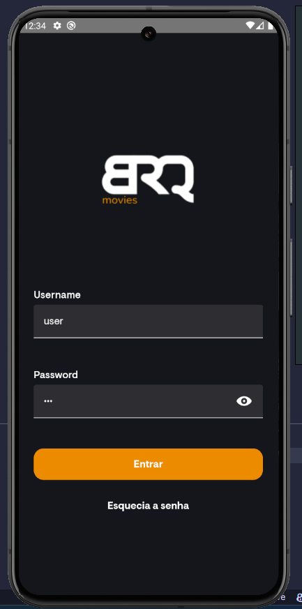
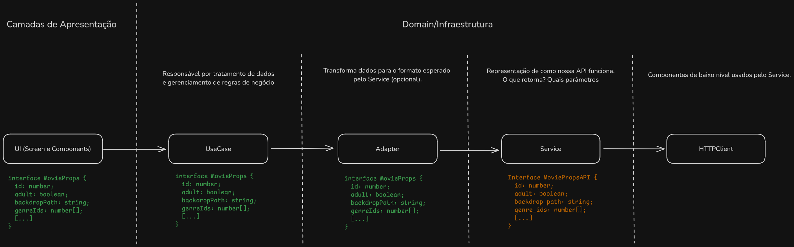
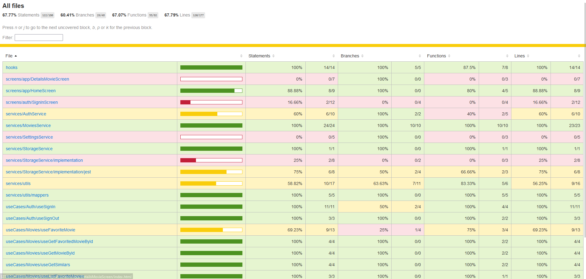

<h1 align="center">BRQ Movies 🎥</h1>

<p align="center">App criado para conhecer todas as novidades sobre cinema 🎞️</p>

## Sobre o App
- O aplicativo foi construído utilizando padrões de arquitetura limpa e modularizada, visando o projeto ser escalavel. [The Clean Architecture](https://blog.cleancoder.com/uncle-bob/2012/08/13/the-clean-architecture.html)

É possível fazer o download do APP através da Google Play, através do link: [Ambiente](https://play.google.com/apps/internaltest/4701704331720763539).

## Requisitos

O projeto foi visa atender os seguintes requisitos:

- Tela de Login:
   - A tela de login permite o acesso à aplicação com uma combinação específica de login/senha: user/123.
   - Foram implementadas validações de campos obrigatórios no login, incluindo a obrigatoriedade de uma senha numérica.

- Tela de Filmes:
   - A tela de filmes possui 2 abas, conforme o protótipo.

- Tela de Detalhes do Filme:
   - Existe a possibilidade de marcar filmes como favoritos, sendo essa funcionalidade um plus.
   - Exibe detalhes do filme como sinopse, popularidade, nota, data de lançamento e votos.

- Tratamento de Erros:
   - O aplicativo lida adequadamente com erros de indisponibilidade de internet ou erros na API.

## Entrega - Screenshots

|   |  |  |  |  |
|:---:|:---:|:---:|:---:|:---:|
| Splash Screen | Home | Details | Favs | SignIn |


## Implementação extra

- CI/CD
   - Pensando na escalabilidade do projeto, adicionei duas pipelines simples no projeto. Uma será disparada no momento da abertura de um PR para a branch principal, no qual irá validar o que foi desenvolvido. A segunda, é disparada manualmente através do painel e tem como objetivo gerar o build do projeto.

- Busca infinita
   - Para uma melhor otimização da projeto, a home sofreu uma alteração, onde busca-se a lista de filmes "paginada", obtendo os 20 primeiros items e, conforme navegação, obtem-se mais dados.

- Adicionar aos favoritos
   - Criou-se um componene flexível para adicionar o filme aos favoritos, este item pode ser usado em qualquer tela, desde que receba o `movieId`.

- Similares
   - Para exemplificar uma implementação nova, foi adicionada a seção de "similares" na página do filme.

## Arquitetura

Exemplificação do que foi desenvolvido a nível de arquitetura.

|  |
|:---:|
| Arquitetura |

## Testes

Visualização do coverage do dia 05/08

|  |
|:---:|
| Coverage |

Visualização dos testes E2E do dia 05/08

|  |
|:---:|
| E2E |

## Bibliotecas Utilizadas

Durante o desenvolvimento do projeto, as seguintes bibliotecas foram utilizadas para aprimorar a funcionalidade e a aparência da aplicação:

-  react-navigation: Responsável pela navegação e gerenciar as transições entre telas.
-  react-native-mmkv: Armazenamento de dados de maneira eficiente e segura.
-  shopify-restyle: Estilização de componentes, seguindo padrões reutilizáveis.
-  zod: Utilizada para validação de dados, garantindo a integridade das informações.
-  react-native-reanimated: Animações.
-  react-query: Gerenciamento de estado e cache de dados.
-  react-native-svg: Renderizar  SVG na aplicação.
-  react-hook-form: Gerenciar formulários de maneira eficiente.
-  mmkv: Gerenciar localstorage,

## Instalação

Para realizar a instalação do projeto, siga os passos abaixo:

```bash
# Baixe este repositório ou clone pelo Git usando o comando:
$ git clone https://github.com/jp-prud/BRQ-Movies

# Acesse a pasta do projeto
$ cd BRQ-Movies

# instale as dependencias
$ yarn install
      ou
$ npm install

# Inicie o Projeto
$ yarn start
      ou
$ npm run start
```

## Arquivo .env

Antes de executar o projeto, você precisará criar um arquivo .env na raiz do projeto com as seguintes variáveis de ambiente:

```
ENV = "development",
API_URL = URL_DA_API_MOVIE_DB
API_KEY = CHAVE_DA_API_MOVIE_DB
API_IMAGE_URL = PATH_IMAGE
API_ACCOUNT_ID = TOKEN_DA_API_MOVIE_DB
ADMIN_USERNAME = SEU_ADMIN_USERNAME -> BRQ: "user"
ADMIN_PASSWORD = SUA_ADMIN_PASSWORD -> BRQ: "123"
```

